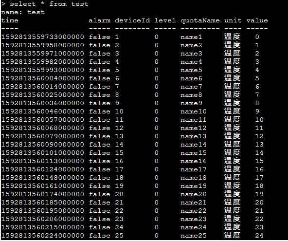
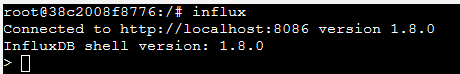
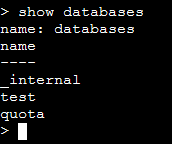
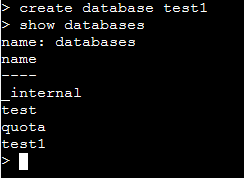
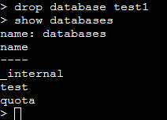
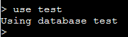
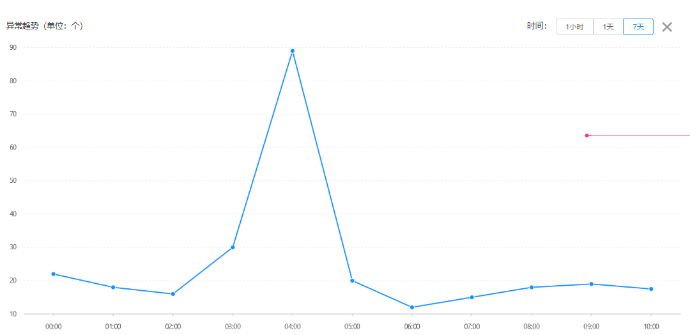
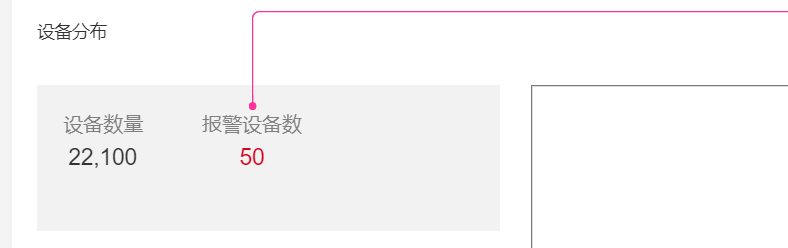

### 本资源由 itjc8.com 收集整理
# 第3章 指标数据持久化与设备详情展示

## 学习目标

了解


## 1. InfluxDB入门及介绍

### 1.1 InfluxDB简介

InfluxDB是一种用Go编写的时间序列数据库，主要用来存储一些时间序列的数据。提供了简单、高效的HTTP读写接口，可以使用类似SQL的语言InfluxQL查询聚合数据，能够使用Tag进行快速高效的查询。

什么是时间序列的数据？从定义上来说，就是一串按时间维度索引的数据。

时间序列数据库(TSDB)特点：

- 持续高并发写入、不用更新
- 数据压缩存储
- 低延时查询

常见的时间序列数据库除了InfluxDB之外还有：opentsdb、timeScaladb、Druid等。

### 1.2 InfluxDB相关概念

在针对InfluxDB进行开发之前，应该了解下该数据库的一些关键概念，以便使我们对此数据库的更全面了解。

与传统数据库相比，InfluxDB在相关概念上有一定的不同，具体的区别如下：

| InfuxDB中的概念 | 传统数据库中的概念 |
| ----------- | --------- |
| database    | 数据库       |
| measurement | 数据库中的表    |
| point       | 表中的行      |

Point是由时间戳(time)、标签(tags)、数据(fields)三部分组成，具体的含义如下：

| point属性 | 含义                                       |
| ------- | ---------------------------------------- |
| time    | 数据记录的时间，主索引，默认自动生成，相当于每行数据都具备的列          |
| tags    | 相当于有索引的列。tag中存储的值的类型是字符串类型               |
| fields  | value值，没有索引的列。field中存储的值得类型：字符串、浮点数(Double)、整数、布尔型。一个field value总是和一个timestamp相关联 |

示例数据：



上面的截图展示了在名字是test的measurement存储的一些数据，我们可以通过常规的sql语句查询到这些数据。这些测试数据是在一定时间内产生的温度指标数据，其中每行数据包含了具体产生的时间(time)、是否告警(alarm)、设备编号(deviceId)、告警级别(level)、指标名称(quotaName)、数值单位(unit)、指标数值(value)。

其中value列就是filed，里面存储的是Integer；time列是每条记录产生的时间；其余列都是tag，存储的数据都是字符串。

### 1.3 InfluxDB的基本操作

首先进入influxdb的容器

```
docker exec -it influxdb /bin/bash
```

容器已经安装了InfluxDB，在命令行里输入`influx`：



就进入了InfluxDB数据库环境了。

#### 1.3.1 InfluxDB数据库操作

- 显示数据库命令`show databases`



- 新建数据库命令 `create database test1`



- 删除数据库命令 `drop database test1`



我们要使用某个数据库，必须要创建，首先执行`create database test`  ，然后执行命令`use test`



#### 1.3.2 InfluxDB数据表操作

 在InfluxDB当中，并没有表（table）这个概念，取而代之的是MEASUREMENTS，MEASUREMENTS的功能与传统数据库中的表一致，因此我们也可以将MEASUREMENTS称为InfluxDB中的表。 

- 显示所有表命令`SHOW MEASUREM ENTS`
- 新建表

 InfluxDB中没有显式的新建表的语句，只能通过insert数据的方式来建立新表，或者在客户端程序代码中插入数据的时候就会自动建表。（写不带索引的值的列，直接空格隔开，值后面加i表示Integer）

```
insert disk_free,hostname=server01 value=442221834240i
```

其中 disk_free 就是表名，hostname是索引（tag），value=xx是记录值（field），记录值可以有多个，带索引的用逗号隔开，不带索引的列在后面用空格与带索引的列隔开，再到后面用逗号与每一个不带索引的列之间相互隔开；系统自带追加时间戳或者添加数据时自己写入时间戳

```
insert disk_free,hostname=server01 value=442221834240i 1435362189575692182
```


- 删除表

```
drop measurement disk_free
```

### 1.4 存储引擎

InfluxDB 采用自研的TSM **(Time-Structured Merge Tree) 作为存储引擎， 其核心思想是通过牺牲掉一些功能来对性能达到极致优化，其官方文档上有项目存储引擎经历了从LevelDB到BlotDB，再到选择自研TSM的过程，整个选择转变的思考。**

TSM存储引擎将多个组件结合在一起，并提供用于存储和查询数据的外部接口。 它由许多组件组成，每个组件都起着特定的作用：



- RP   **retention policy**: 存储策略，用于设置数据保留的时间，每个数据库刚开始会自动创建一个默认的存储策略 autogen，数据保留时间为永久，之后用户可以自己设置，例如保留最近2小时的数据。插入和查询数据时如果不指定存储策略，则使用默认存储策略，且默认存储策略可以修改。InfluxDB 会定期清除过期的数据。
- WAL —— WAL是一种写优化的存储格式，允许写入持久化，但不容易查询。 对WAL的写入就是append到固定大小的段中。
- Cache —— Cache是存储在WAL中的数据的内存中的表示。 它在运行时可以被查询，并与TSM文件中存储的数据进行合并。
- TSM Files —— 单个 tsm file 大小最大为 2GB，用于存放数据。TSM file 使用了自己设计的格式，对查询性能以及压缩方面进行了很多优化。
- Compactor —— Compactor负责将不够优化的Cache和TSM数据转换为读取更为优化的格式。 它通过压缩，去除已经删除的数据，优化索引并将较小的文件组合成较大的文件来实现。

**存储目录**

influxdb的数据存储有三个目录，分别是meta、wal、data：

- meta 用于存储数据库的一些元数据，meta 目录下有一个 meta.db 文件；
- wal 目录存放预写日志文件，以 .wal 结尾；
- data 目录存放实际存储的数据文件，以 .tsm 结尾。


## 2.指标数据持久化

### 2.1 需求分析

上一章讲解了从EMQ中接收数据并解析数据，并没有涉及讲解解析完成之后之后的数据的数据存储实现。解析之后的数据存储就是我们当前需要解决的事情，考虑到我们亿可控系统主要是通过接收存储大量物联网设备频繁上报的指标数据，所以像mysql这样的关系型数据库就不能满足我们的需求了，所以就引入了专门来解决这种大量的IOT设备数据插入和检索的数据库:InfluxDB。

### 2.2 实现思路

（1）在InfluxDB中创建数据库用来存储指标数据

（2）在项目代码中定义InfluxDB中存储的数据对象，在对从EMQ接收的数据解析完成之后转换为该对象

（3）在项目代码中定义一个专门和InfluxDB通信的类来负责和数据库打交道对数据进行存取

（4）在指标服务实现逻辑中定义相关方法来封装将指标数据存入InfluxDB中的具体逻辑

（5）在原来的接收EMQ数据转化完成需要存储到数据库的地方添加调用逻辑将数据存储到InfluxDB中

### 2.3 代码实现

#### 2.3.1 InfluxDB集成与添加数据

（1）通过终端命令行登录到InfluxDB中，并执行建库命令

```
influx
create database ykk
```

（2）在ykk-backend项目中添加InfluxDB的相关依赖包

```xml
<dependency>
    <groupId>org.influxdb</groupId>
    <artifactId>influxdb-java</artifactId>
    <version>2.19</version>
</dependency>
```

（3）添加配置

```yaml
  influx:
    db: ykk
    url: http://192.168.200.128:8086
    user: root
    password: root
```

（4） 创建com.yikekong.influx包 ，在com.yikekong.influx包下添加用来和InfluxDB直接通信的Repository类，并实现新增数据的方法

```java
package com.yikekong.influx;

import lombok.extern.slf4j.Slf4j;
import org.influxdb.InfluxDB;
import org.influxdb.dto.Point;
import org.springframework.beans.factory.annotation.Autowired;
import org.springframework.beans.factory.annotation.Value;
import org.springframework.stereotype.Component;

import java.time.LocalDateTime;
import java.time.ZoneOffset;
import java.util.concurrent.TimeUnit;

@Component
@Slf4j
public class InfluxRepository {

    @Autowired
    private InfluxDB influxDB;

    @Value("${spring.influx.db}")
    private String dbName;

    /**
     * 添加数据
     * @param object
     */
    public void add( Object object ){
        Point.Builder pointBuilder= Point.measurementByPOJO( object.getClass() );

        Point point = pointBuilder.addFieldsFromPOJO(object)
                .time(LocalDateTime.now().plusHours(8).toInstant(ZoneOffset.of("+8")).toEpochMilli() , TimeUnit.MILLISECONDS)
                .build();
        influxDB.setDatabase(dbName);
        influxDB.write(point);
        influxDB.close();
    }
}
```

post方法用来向InfluxDB中插入数据   在post方法中通过pointBuilder的addFieldsFromPOJO方法将QuotaInfo对象中的所有属性转换为tag添加到point中，然后调用time方法将当前时间设置进去，通过influxDB的setDatabase设置好要存储的数据库名称，最后调用write方法将数据插入到表(Measurement)中。

因为InfluxDB自动生成的time时间列为UTC时间，所以在存储时我们再单独设置。

java.time.Instant.toEpochMilli()  自`1970-01-01T00：00：00Z`时代以来的毫秒数。

（5）添加QuotaInfo类

```java
package com.yikekong.dto;

import lombok.Data;
import org.influxdb.annotation.Column;
import org.influxdb.annotation.Measurement;

@Data
@Measurement(name = "quota")
public class QuotaInfo {

    @Column(name = "deviceId",tag = true)
    private String deviceId;//设备id

    @Column(name = "quotaId",tag = true)
    private String quotaId;//指标id

    @Column(name = "quotaName",tag = true)
    private String quotaName;//指标名称

    @Column(name = "alarm" ,tag = true)
    private String alarm;//是否告警  0：不告警  1：告警

    @Column(name = "level" ,tag = true)
    private String level;//告警级别

    @Column(name = "alarmName" ,tag = true)
    private String alarmName;//告警名称

    @Column(name = "unit",tag = true)
    private String unit;//单位

    @Column(name = "referenceValue",tag = true)
    private String referenceValue;//参考值

    @Column(name = "value")
    private Double value;//数值指标

    @Column(name = "stringValue")
    private String stringValue;//非数值指标

}
```

针对对应InfluxDB中tag的映射，需要在我们定义的字段上加`@Column`注解，且用`name`来设置对应的tag名，也就是类似列名，并且设置`tag`为`true`证明是tag(tag只能为字符串)。

在该类上添加@Measurement注解用来标注最终存储的表名，这样在插入数据时会自动创建该Measurement，名字为quota。

（6）编写单元测试

```java
@SpringBootTest
@RunWith(SpringRunner.class)
public class InfluxTest {

    @Autowired
    private InfluxDBRepository influxDBRepository;

    @Test
    public void testPost(){
        QuotaInfo quotaInfo=new QuotaInfo();
        quotaInfo.setQuotaName("温度");
        quotaInfo.setAlarm("1");
        quotaInfo.setOnline("1");
        quotaInfo.setValue("111221");
        influxDBRepository.post(quotaInfo);
    }
}
```

#### 2.3.2 将指标数据持久化

（1）QuotaService 新增方法定义

```java
/***
 * 保存指标数据到influxDb
 * @param quotaDTOList
 */
void saveQuotaToInflux(List<QuotaDTO> quotaDTOList);
```

QuotaServiceImpl实现此方法

```java
@Override
public void saveQuotaToInflux(List<QuotaDTO> quotaDTOList) {
    for(QuotaDTO quotaDTO:quotaDTOList){
        QuotaInfo quotaInfo=new QuotaInfo();
        BeanUtils.copyProperties(quotaDTO,quotaInfo);//拷贝属性
        quotaInfo.setQuotaId(quotaDTO.getId()+"");//指标id
        influxDBRepository.add(quotaInfo);
    }
}
```

（2）EmqMsgProcess的 messageArrived方法 新增代码

```java
//保存指标数据
quotaService.saveQuotaToInflux(deviceInfoDTO.getQuotaList());
```

测试：

（1）启动亿可控工程

（2）通过EMQ的Websocket工具模拟发送报文数据

（3）查询influxdb中是否成功插入数据

## 3. 报警日志查询 

### 3.1 需求分析

在系统中能够按照一定条件检索告警日志，然后进行搜索展示，具体的展示效果如下：



### 3.2 实现思路 

（1）编写查询语句，实现分页+模糊条件查询。

（2）编写通用的查询方法。

（3）在服务层实现查询语句的封装，并在controller中调用服务层中的方法将数据返回。

### 3.3 代码实现 

#### 3.3.1 编写查询语句

> 知识点：
>
> InfluxDB中的模糊搜索和mysql中的模糊搜索是不一样的，具体的规则如下：
>
> - 实现查询包含给定字段数据
>
> select fieldName from measurementName where fieldName=~/条件值/
>
> - 实现查询以给定字段开始的数据
>
> select fieldName from measurementName where fieldName=~/^条件值/
>
> - 实现查询以给定字段结束的数据
>
> select fieldName from measurementName where fieldName=~/条件值$/

分页+模糊条件查询

```sql
select * from quota  where time>='2020-01-01' and time<='2020-12-31' and alarmName=~/温度/ and deviceId=~/^12/ and alarm='1' order by desc limit 10 offset 0
```

在该方法中我们要从InfluxDB中对`alarmName`进行全模糊搜索，对`deviceId`进行左匹配模糊搜索.

------

按条件统计记录个数，用于分页

```sql
select count(value) from quota  where time>='2020-01-01' and time<='2020-12-31' and alarmName=~/温度/ and deviceId=~/^12/ and alarm='1'
```

#### 3.3.2 封装查询语句

（1）InfluxDBRepository新增通用的查询方法

```java
/**
 * 查询数据方法
 * @param sql
 * @param clazz
 * @param <T>
 * @return
 */
public <T> List<T> query(String ql, Class<T> clazz){
    QueryResult queryResult = influxDB.query(new Query(ql, dbName));
    influxDB.close();
    InfluxDBResultMapper resultMapper = new InfluxDBResultMapper();
    return resultMapper.toPOJO(queryResult, clazz);
}
```

（2）包括时间字段的指标对象

```java
package com.yikekong.dto;
import lombok.Data;
import org.influxdb.annotation.Column;
import org.influxdb.annotation.Measurement;

@Data
@Measurement(name = "quota")
public class QuotaAllInfo extends QuotaInfo{
    @Column(name = "time")
    private String time;
}
```

（3）创建用于封装记录个数的DTO

```java
package com.yikekong.dto;

import lombok.Data;
import org.influxdb.annotation.Column;
import org.influxdb.annotation.Measurement;

/**
 * 封装统计记录数
 */
@Data
@Measurement(name = "quota")
public class QuotaCount {

    @Column(name = "count")
    private Long count;

}
```

（4）在AlarmService接口添加告警日志搜索方法定义

```java
/**
     * 查询告警日志
     * @param page
     * @param pageSize
     * @param start
     * @param end
     * @param alarmName
     * @param deviceId
     * @return
     */
Pager<QuotaAllInfo> queryAlarmLog(Long page, Long pageSize, String start, String end, String alarmName, String deviceId);
```

在AlarmServiceImpl实现类中实现该方法

```java
private InfluxRepository influxRepository;

@Override
public Pager<QuotaAllInfo> queryAlarmLog(Long page, Long pageSize, String start, String end, String alarmName, String deviceId) {
    //1.where条件查询语句部分构建
    StringBuilder whereQl=new StringBuilder("where alarm='1' ");
    if(!Strings.isNullOrEmpty(start)){
        whereQl.append("and time>='"+start +"' ");
    }
    if(!Strings.isNullOrEmpty(end)){
        whereQl.append("and time<='"+end +"' ");
    }
    if(!Strings.isNullOrEmpty(alarmName)){
        whereQl.append("and alarmName=~/"+ alarmName+"/ ");
    }
    if(!Strings.isNullOrEmpty(deviceId)){
        whereQl.append("and deviceId=~/^"+deviceId+"/ ");
    }

    //2.查询记录语句
    StringBuilder listQl=new StringBuilder("select * from quota  ");
    listQl.append( whereQl.toString() );
    listQl.append( "order by desc limit "+ pageSize+" offset "+ (page-1)*pageSize   );

    //3.查询记录数语句
    StringBuilder countQl=new StringBuilder("select count(value) from quota ");
    countQl.append(whereQl.toString());

    //4.执行查询记录语句
    List<QuotaAllInfo> quotaList = influxRepository.query(listQl.toString(), QuotaAllInfo.class);

    //5.执行统计语句
    List<QuotaCount> quotaCount = influxRepository.query(countQl.toString(), QuotaCount.class);

    //6.返回结果封装
    if(quotaCount==null || quotaCount.size()<=0){
        Pager<QuotaAllInfo> pager=new Pager<>(0l,0L);
        pager.setPage(0);
        pager.setItems(Lists.newArrayList());
        return pager;
    }
    Long totalCount=   quotaCount.get(0).getCount();//记录数
    Pager<QuotaAllInfo> pager=new Pager<>(totalCount,pageSize);
    pager.setPage(page);
    pager.setItems( quotaList );
    return pager;
}
```

（6） 在AlarmController中添加返回给前端的方法，在该方法中调用服务层的方法将结果返回

```java
@GetMapping("/log")
public Pager<QuotaAllInfo> alarmLog(@RequestParam(value = "page",required = false,defaultValue = "1") Long page,
                                 @RequestParam(value = "pageSize",required = false,defaultValue = "10") Long pageSize,
                                 @RequestParam(value = "start") String start,
                                 @RequestParam(value = "end") String end,
                                 @RequestParam(value = "alarmName",required = false,defaultValue = "") String alarmName,
                                 @RequestParam(value = "deviceId",required = false,defaultValue = "") String deviceId){
    return alarmService.queryAlarmLog(page,pageSize,start,end,alarmName,deviceId);
}
```

#### 3.3.3 时间格式处理

修改AlarmServiceImpl的queryAlarmLog方法

```java
//4.执行查询记录语句
List<QuotaAllInfo> quotaList = influxRepository.query(listQl.toString(), QuotaAllInfo.class);
// 添加时间格式处理
for(QuotaAllInfo quotaAllInfo:quotaList){
    //2020-09-19T09:58:34.926Z   DateTimeFormatter.ISO_OFFSET_DATE_TIME
    //转换为 2020-09-19 09:58:34  格式
    LocalDateTime dateTime = LocalDateTime.parse(quotaAllInfo.getTime(), DateTimeFormatter.ISO_OFFSET_DATE_TIME);
    String time = dateTime.format(DateTimeFormatter.ofPattern("yyyy-MM-dd hh:mm:ss"));
    quotaAllInfo.setTime(time);
}
```

#### 3.3.4 设备报文数据模拟&功能测试

我们目前数据库里的记录非常少，不利于我们之后的测试，所以我这里写了一个模拟发送报文数据的定时任务：模拟10台（可以自定义）设备发送报文，指标值随机。

```java
package com.yikekong.emq;
import com.fasterxml.jackson.core.JsonProcessingException;
import com.google.common.collect.Maps;
import com.yikekong.entity.QuotaEntity;
import com.yikekong.service.QuotaService;
import com.yikekong.util.JsonUtil;
import org.springframework.beans.factory.annotation.Autowired;
import org.springframework.scheduling.annotation.Scheduled;
import org.springframework.stereotype.Component;

import java.time.LocalDateTime;
import java.util.List;
import java.util.Map;
import java.util.Random;

@Component
public class Mock {

    @Autowired
    private QuotaService quotaService;

    @Autowired
    private EmqClient emqClient;

    @Scheduled(cron = "0/10 * * * * ?")
    public void addDatas(){
        System.out.println(LocalDateTime.now()+"报文数据模拟中");
        //提取指标
        List<QuotaEntity> quotaList = quotaService.list();
        //模拟10台设备
        for(int i=0;i<10;i++){
            String deviceId=100000+i+""; //设备编号
            //提取指标
            for(QuotaEntity quotaEntity:quotaList){
                Map<String,Object> map= Maps.newHashMap();
                map.put(quotaEntity.getSnKey(),deviceId);
                //随机产生
                Random random=new Random();
                int quotaValue = random.nextInt(40);
                map.put(quotaEntity.getValueKey(),quotaValue);
                try {
                    String json = JsonUtil.serialize(map);
                    emqClient.publish(quotaEntity.getSubject(),json);
                    Thread.sleep(20);
                } catch (JsonProcessingException e) {
                    e.printStackTrace();
                } catch (InterruptedException e) {
                    e.printStackTrace();
                }
            }
        }
    }
}
```

控制台运行效果

```
接收到数据：{"temp":8,"sn":"100004"}
接收到数据：{"h":8,"sn":"100004"}
接收到数据：{"temp":1,"sn":"100005"}
接收到数据：{"h":37,"sn":"100005"}
接收到数据：{"temp":13,"sn":"100006"}
接收到数据：{"h":32,"sn":"100006"}
接收到数据：{"temp":1,"sn":"100007"}
接收到数据：{"h":31,"sn":"100007"}
接收到数据：{"temp":26,"sn":"100008"}
接收到数据：{"h":38,"sn":"100008"}
接收到数据：{"temp":16,"sn":"100009"}
接收到数据：{"h":33,"sn":"100009"}
2020-09-22T10:53:30.001报文数据模拟中
接收到数据：{"temp":20,"sn":"100000"}
接收到数据：{"h":31,"sn":"100000"}
```

运行一段时间后，我们再次测试报警日志查询

## 4. 设备详情展示 

### 4.1 需求分析 

在系统中需要分页展示出设备详情列表来，其中每一个设备都要展示当前所有指标的最新值，在线状态等信息。而且可以根据设备的状态、设备的标签、设备编号进行筛选。具体的实现效果如下：


前端页面要根据设备的最新告警状态展示不同的颜色以示区别。

### 4.2 实现思路 

搜索时，根据搜索条件先从ElasticSearch中查询出相应设备的最新指标状态和在线状态，然后再根据设备的编号从InfluxDB中得到设备的所有指标数据，最后将符合条件的所有设备及设备的所有指标状态返回。

### 4.3 代码实现 

#### 4.3.1 按设备ID获取最新指标

（1）查询语句

```sql
select last(value),* from quota where deviceId='' group by quotaId
```

这里我们先通过`group by`将设备指标分组，然后再通过`last(value)`就能获取到设备下所有指标的最新数据了。

（2）在QuotaService接口定义获取设备所有最新指标数据的方法：

```java
/**
 * 根据设备id查询最新指标
 * @param deviceId
 * @return
 */
List<QuotaInfo> getLastQuotaList(String deviceId);
```

在QuotaServiceImpl实现类中实现该方法：

```java
@Override
public List<QuotaInfo> getLastQuotaList(String deviceId) {
    String ql="select last(value),* from quota where deviceId='"+ deviceId+"' group by quotaId";
    return influxRepository.query(ql,QuotaInfo.class);
}
```

单元测试 

```java
@Test
public void testFindLast(){
    List<QuotaInfo> quotaList = quotaService.getLastQuotaList("100001");
    try {
        String json = JsonUtil.serialize(quotaList);
        System.out.println(json);
    } catch (JsonProcessingException e) {
        e.printStackTrace();
    }
}
```

#### 4.3.2 分页显示设备列表

（1）创建VO

```java
package com.yikekong.vo;

import com.yikekong.dto.QuotaInfo;
import lombok.Data;

import java.util.List;

/**
 * 设备指标详情vo
 */
@Data
public class DeviceQuotaVO {

    private String deviceId;//设备编号

    private Boolean online;//在线状态

    private Integer level;//告警级别

    private List<QuotaInfo> quotaList;//指标列表
        
}
```

（2）在DeviceService接口定义获取设备详情的方法：

```java
/**
 * 查询设备详情
 * @param page
 * @param pageSize
 * @param deviceId
 * @param tag
 * @param state
 * @return
 */
Pager<DeviceQuotaVO> queryDeviceQuota(Long page, Long pageSize, String deviceId, String tag, Integer state);
```

在DeviceServiceImpl实现类中通过调用前面两个方法组合出最终的数据接口：

```java
@Autowired
private QuotaService quotaService;

@Override
public Pager<DeviceQuotaVO> queryDeviceQuota(Long page, Long pageSize, String deviceId, String tag, Integer state) {

    //1.查询设备列表

    Pager<DeviceDTO> pager = esRepository.searchDevice(page, pageSize, deviceId, tag, state);


    //2.查询指标列表
    List<DeviceQuotaVO> deviceQuotaVOList= Lists.newArrayList();
    pager.getItems().forEach(deviceDTO -> {
        DeviceQuotaVO deviceQuotaVO=new DeviceQuotaVO();
        BeanUtils.copyProperties(deviceDTO, deviceQuotaVO );
        //查询指标
        List<QuotaInfo> quotaList = quotaService.getLastQuotaList(deviceDTO.getDeviceId());
        deviceQuotaVO.setQuotaList(quotaList);
        deviceQuotaVOList.add(deviceQuotaVO);
    });

    //3.封装返回结果
    Pager<DeviceQuotaVO> pageResult=new Pager(pager.getCounts(),pageSize);
    pageResult.setItems(deviceQuotaVOList);

    return pageResult;
}
```

（3）在DeviceController中调用：

```java
/**
 * 设备详情
 * @param page
 * @param pageSize
 * @param deviceId
 * @param tag
 * @param state
 * @return
 */
@GetMapping("/deviceQuota")
public  Pager<DeviceQuotaVO> queryQuotaData(@RequestParam(value="page",required = false,defaultValue = "1") Long page,
                                            @RequestParam(value = "pageSize",required = false,defaultValue = "10") Long pageSize,
                                            @RequestParam(value = "deviceId",required = false) String deviceId,
                                            @RequestParam(value = "tag",required = false)  String tag,
                                            @RequestParam(value = "state",required = false)  Integer state){
        return deviceService.queryDeviceQuota(page,pageSize,deviceId,tag,state);
}
```

 

