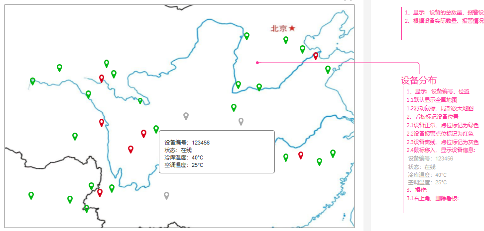
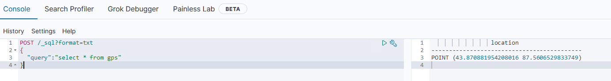
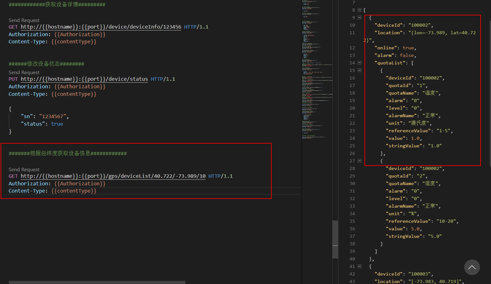
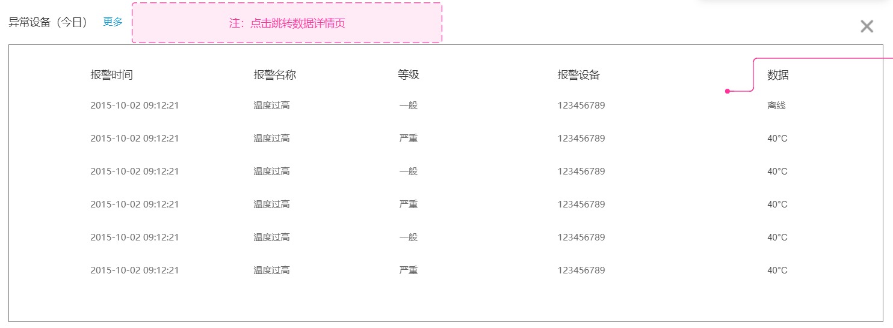
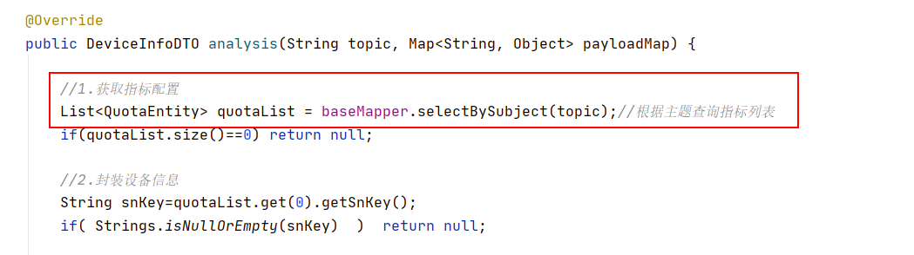

### 本资源由 itjc8.com 收集整理
# 第5章 GPS采集搜索与数据透传

产品原型地址：

https://app.mockplus.cn/run/prototype/wDiGCuki3_/iLu4KtCQ8ew/1Bv0BoAUyv

## 1. 设备GPS信息采集

### 1.1 需求分析



我们需要将设备上报上来的GPS信息存储到Elasticsearch中。

### 1.2 实现思路

（1）通过解析设备报文解析判断是否是GPS指标数据

（2）如果是GPS指标数据则解析并存储到Elasticsearch中

### 1.3 ElasticSearch地理位置保存

地理坐标点是指地球表面可以用经纬度描述的一个点。 地理坐标点可以用来计算两个坐标间的距离，还可以判断一个坐标是否在一个区域中，或在聚合中。

地理坐标点不能被动态映射自动检测，需要显式声明对应字段类型为 `geo-point` ：

```http
PUT /gps
{
  "mappings": {
	 "properties": {
		"location": {
		  "type": "geo_point"
		}
	 }
  }
}
```

需要显示指定location的类型为`geo_point`。

经纬度在ElasticSearch中的保存时的形式可以是字符串、数组或者对象。

```json
PUT /gps/_doc/100001
{
  "location": "40.715, -74.011" 
}

PUT /gps/_doc/100002
{
  "location": { 
    "lat":     40.722,
    "lon":    -73.989
  }
}

PUT /gps/_doc/100003
{
  "location": [ -73.983, 40.719 ] 
}
```

- 字符串形式以半角逗号分割，如 `"lat,lon"` 
- 对象形式显式命名为 `lat` 和 `lon` 
- 数组形式表示为 `[lon,lat]` 

可能所有人都至少一次踩过这个坑：地理坐标点用字符串形式表示时是纬度在前，经度在后（ `"latitude,longitude"` ），而数组形式表示时是经度在前，纬度在后（ `[longitude,latitude]` ）—顺序刚好相反。

### 1.4 代码实现 

#### 1.4.1 GPS主题订阅 

我们现在查看一下gps表的结构


表中有数据


（1）修改GpsServiceImpl的update方法，在用户修改gps定义时重新订阅主题

```java
@Autowired
private EmqClient emqClient;

@Override
public boolean update(GPSEntity gpsEntity) {
    //订阅主题
    try {
        emqClient.subscribe("$queue/"+gpsEntity.getSubject());
    } catch (MqttException e) {
        log.error("subscribe error",e);
    }
    gpsEntity.setId(1);
    return this.updateById(gpsEntity);
}
```

（2）修改Monitor的init方法，订阅GPS主题

```java
@Autowired
private GpsService gpsService;

/**
 * 自动订阅主题
 */
public void init(){
    quotaService
        .getAllSubject()
        .forEach(s->{
            try {
                //通过共享订阅以免影响其他系统接收消息，并且可以通过负载均衡实现消息的接收处理，以免客户端发过来的消息频率过大，服务端被击垮
                emqClient.subscribe("$queue/"+s);
                System.out.println("订阅主题："+s);
            } catch (MqttException e) {
                log.error("订阅主题出错："+ s,e);
            }
    });

    //----------------订阅gps主题数据-------------------
    GPSEntity gpsEntity = gpsService.getGps();
    if(gpsEntity == null) return;
    try {
        if(Strings.isNotEmpty(gpsEntity.getSubject())){  //如果主题不为空
            emqClient.subscribe("$queue/"+gpsEntity.getSubject());  
        }
    } catch (MqttException e) {
        log.error("订阅主题出错：",e);
    }    
}
```

#### 1.4.2 GPS数据解析 

（1）定义DTO

```java
package com.yikekong.dto;
import lombok.Data;
import java.io.Serializable;

@Data
public class DeviceLocation implements Serializable{
    private String deviceId;
    private String location;
}
```

（2）GpsService新增方法定义，用于解析报文

```java
/**
 * 解析报文获得GPS信息
 * @param payloadMap 报文内容
 * @return gps
 */
DeviceLocation analysis(String topic, Map<String, Object> payloadMap);
```

GpsServiceImpl实现该方法

```java
@Override
public DeviceLocation analysis(String topic, Map<String, Object> payloadMap) {
    //读取规则
    GPSEntity gpsEntity = getGps();
    if(gpsEntity == null) return null;
    if(Strings.isNullOrEmpty(gpsEntity.getSubject())) return null;// 主题为空
    if(!topic.equals(gpsEntity.getSubject()))  return null;//如果主题不匹配

    //读取设备id
    String deviceId = "";
    deviceId = (String) payloadMap.get(gpsEntity.getSnKey());
    if(Strings.isNullOrEmpty(deviceId)) return null;

    //提取gps
    String location = "";
    if(gpsEntity.getSingleField()){ //如果是单字段
        location = ((String) payloadMap.get(gpsEntity.getValueKey())).replace(gpsEntity.getSeparation(),",");
    }else { //如果是双字段
        location = payloadMap.get(gpsEntity.getLongitude()) + "," +  payloadMap.get(gpsEntity.getLatitude());
    }
    
    //封装返回结果
    if(location!=null){
        DeviceLocation deviceLocation=new DeviceLocation();
        deviceLocation.setDeviceId(deviceId);
        deviceLocation.setLocation(location);
        return deviceLocation;
    }else{
        return  null;
    }
}
```

（3）修改EmqMsgProcess的messageArrived方法，添加处理gps数据的代码

```java
//处理gps数据
DeviceLocation deviceLocation = gpsService.analysis(topic, payloadMap);//解析
```

将亿可控项目代码运行起来，通过EMQ测试客户端向gps主题下发送一条数据，具体的数据内容:

如果single_field值为0（双字段）

```json
{"sn":"100001","lon":"43.870882","lat":"87.560653"}
```

如果single_field值为1（单字段）

```json
{"sn":"100001","gps":"43.870882,87.560653"}
```

#### 1.4.3 GPS数据保存

（1）ESRepository新增方法用于存储设备的gps

```java
/**
 * 更新设备gps信息
 * @param deviceLocation
 */
public void saveLocation(DeviceLocation deviceLocation){
    try{
        IndexRequest request = new IndexRequest("gps");
        request.source("location",deviceLocation.getLocation());
        request.id(deviceLocation.getDeviceId());
        client.index(request,RequestOptions.DEFAULT);
    }catch (Exception e){
        log.error("update es error",e);
    }
}
```

（2）修改EmqMsgProcess的messageArrived方法，添加保存gps数据的方法

```java
if(deviceLocation!=null){
    esRepository.saveLocation(deviceLocation);
}
```

测试：

将亿可控项目代码运行起来，通过EMQ测试客户端向gps主题下发送一条数据，具体的数据内容如下：

```json
{
    "lat": 87.560653,
    "lon": 43.870882,
    "deviceSn": "123456"
}
```

此时我们查询下es检查数据是否正确被存储进去了，运行查询发现数据已经进去了：



## 2. 设备GPS位置搜索

### 2.1 需求分析 

系统要在首页展示出设备的分布情况，点击每个设备要显示的状态和指标详情。具体效果如下：


### 2.2 实现思路  

（1）在Elasticsearch通信类里实现根据坐标点及公里范围半径查询设备列表的方法

（2） 在服务层接收坐标点和公里范围参数，将这些参数传入Elasticsearch通信类查询设备位置信息列表，然后再根据所查询出的设备列表从InfluxDB中查询出该设备所有指标数据进行组合将结果返回

（3） 通过定义前端Controller接口接收一个经纬度坐标点和一个公里为单位的距离，通过调用服务层接口返回设备状态信息及坐标信息列表。

### 2.3 ElasticSearch地理距离过滤器

地理距离过滤器（ `geo_distance` ）以给定位置为圆心画一个圆，来找出那些地理坐标落在其中的文档： 

```json
GET gps/_search
{
  "query": {
    "geo_distance": {
      "distance": "1km", 
      "location": { 
        "lat" : 40.722,
        "lon" : -73.989
      }
    }
  }
}
```

- "distance": "1km"： 找出所有与指定点距离在 `1km` 内的 `location` 字段
- 中心点可以表示为字符串，数组或者（如示例中的）对象 

### 2.4 代码实现 

#### 2.4.1 搜索一定距离内设备列表

在`ESRepository`中实现根据坐标点及半径距离查询设备位置的方法：

```java
/**
 * 搜索一定距离之内的设备
 * @param distance 距离坐标点半径
 * @return
 */
public List<DeviceLocation> searchDeviceLocation(Double lat,Double lon,Integer distance){
    SearchRequest searchRequest = new SearchRequest("gps");
    SearchSourceBuilder searchSourceBuilder = new SearchSourceBuilder();

    //中心点及半径构建
    GeoDistanceQueryBuilder geoDistanceQueryBuilder = new GeoDistanceQueryBuilder("location");
    geoDistanceQueryBuilder.distance(distance, DistanceUnit.KILOMETERS);
    geoDistanceQueryBuilder.point(lat,lon);

    searchSourceBuilder.query(geoDistanceQueryBuilder);

    //只取前200个
    searchSourceBuilder.from(0);
    searchSourceBuilder.size(200);
    searchRequest.source(searchSourceBuilder);

    try {
        SearchResponse searchResponse = restHighLevelClient.search(searchRequest,RequestOptions.DEFAULT);
        SearchHits hits = searchResponse.getHits();
        if(hits.getTotalHits().value <= 0){
            return Lists.newArrayList();
        }
        List<DeviceLocation> deviceLocationList = Lists.newArrayList();
        Arrays.stream(hits.getHits()).forEach(h->{
            DeviceLocation deviceLocation = new DeviceLocation();
            deviceLocation.setDeviceId(h.getId());
            deviceLocation.setLocation(h.getSourceAsMap().get("location").toString());
            deviceLocationList.add(deviceLocation);
        });

        return deviceLocationList;
    } catch (IOException e) {
        log.error("search location error",e);

        return Lists.newArrayList();
    }
}
```

单元测试：

```java
@Test
public void testGEO(){
    List<DeviceLocation> deviceLocations = esRepository.searchDeviceLocation(40.722, -73.989, 10);
    try {
        System.out.println(JsonUtil.serialize(deviceLocations));
    } catch (JsonProcessingException e) {
        e.printStackTrace();
    }
}
```

如果要对搜索结果进行远近的排序，则在searchDeviceLocation方法中添加以下代码：

```java
    //从近到远排序规则构建
    GeoDistanceSortBuilder distanceSortBuilder = new GeoDistanceSortBuilder("location",lat,lon);
    distanceSortBuilder.unit(DistanceUnit.KILOMETERS);
    distanceSortBuilder.order(SortOrder.ASC);
    distanceSortBuilder.geoDistance(GeoDistance.ARC);
    
    searchSourceBuilder.sort(distanceSortBuilder);
```

#### 2.4.2 按坐标与范围查询设备详情 

（1）定义一个带有设备全部状态和指标的DTO对象：

```java
package com.yikekong.dto;
import lombok.Data;
import java.io.Serializable;
import java.util.List;

@Data
public class DeviceFullInfo implements Serializable{
    private List<QuotaInfo> quotaList;
    private String location;
    private String deviceId;
    private Boolean online;
    private Boolean alarm;
}
```

（2）在GpsService服务接口中定义通过经纬度坐标和距离半径获取设备全部信息列表的方法

```java
/**
* 根据经纬度获取一定范围内的设备信息
* @param lat
* @param lon
* @param distance
* @return
*/
List<DeviceFullInfo> getDeviceFullInfo(Double lat,Double lon,Integer distance);
```

在GpsServiceImpl实现类中实现该方法

```java
@Autowired
private ESRepository esRepository;

@Autowired
private QuotaService quotaService;

@Override
public List<DeviceFullInfo> getDeviceFullInfo(Double lat, Double lon, Integer distance) {
    //按范围查询设备
    List<DeviceLocation> deviceLocationList = esRepository.searchDeviceLocation(lat, lon, distance);

    List<DeviceFullInfo> deviceFullInfoList= Lists.newArrayList();

    //查询设备详情
    deviceLocationList.forEach( deviceLocation -> {
        DeviceFullInfo deviceFullInfo=new DeviceFullInfo();
        deviceFullInfo.setDeviceId(deviceLocation.getDeviceId());//设备id
        deviceFullInfo.setLocation(deviceLocation.getLocation());//坐标

        //在线状态和告警状态

        DeviceDTO deviceDTO = esRepository.searchDeviceById(deviceLocation.getDeviceId());
        if(deviceDTO==null){
            deviceFullInfo.setOnline(false);
            deviceFullInfo.setAlarm(false);
        }else{
            deviceFullInfo.setOnline( deviceDTO.getOnline() );
            deviceFullInfo.setAlarm(deviceDTO.getAlarm());
        }

        //指标
        List<QuotaInfo> quotaList = quotaService.getLastQuotaList(deviceLocation.getDeviceId());
        deviceFullInfo.setQuotaList( quotaList );

        deviceFullInfoList.add(deviceFullInfo);
    } );

    return deviceFullInfoList;
}
```

（3）在GpsController中定义前端接口方法通过查询将结果返回

```java
    /**
     * 根据经纬度获取设备信息
     * @param lat
     * @param lon
     * @param distance
     * @return
     */
    @GetMapping("/deviceList/{lat}/{lon}/{distance}")
    public List<DeviceFullInfo> getDeviceFullInfo(
            @PathVariable Double lat, 
            @PathVariable Double lon, 
            @PathVariable Integer distance){
        return gpsService.getDeviceFullInfo(lat,lon,distance);
    }
```

测试接口




## 3. 数据透传

### 3.1 需求分析

所谓透传，就是信息发送到外部业务系统的url。作为一个物联网数据中台，亿可控系统需要将解析过来的指标数据以及报警数据透传给其它的业务系统。这里包括4部分：

（1）指标的数据透传

将解析的指标直接透传给其它业务系统

（2）告警的数据透传

告警有一个沉默周期的设置。例如沉默周期设置为5分钟。那么5分钟内不会为同一个指标的同一种告警进行重复告警，超过5分钟才会再次告警。

（3）离线告警的数据透传

（4）GPS数据透传

### 3.2 实现思路

我们工程中提供工具类HttpUtil可以用于将数据发送给其它系统。

（1）直接将解析后的指标数据利用透传工具进行透传。

（2）编写数据告警透传逻辑。利用redis的过期时间来实现沉默周期告警逻辑。

### 3.3 代码实现

#### 3.3.1 指标数据透传

（1）创建NoticeService接口，并定义方法

```java
package com.yikekong.service;

import com.yikekong.dto.QuotaDTO;

import java.util.List;

/**
 * 通知(透传)服务
 */
public interface NoticeService {

    /**
     * 指标数据透传
     * @param quotaDTOList
     */
    void quotaTransfer(List<QuotaDTO> quotaDTOList);
}
```

创建NoticeServiceImpl 并实现方法

```java
    @Override
    public void quotaTransfer(List<QuotaDTO> quotaDTOList) {
        for( QuotaDTO quotaDTO:quotaDTOList ){
            if(!Strings.isNullOrEmpty(quotaDTO.getWebhook())){  //如果钩子非空，则做数据透传
                HttpUtil.httpPost(quotaDTO.getWebhook(),quotaDTO);
            }
        }
    }
```

（2）修改EmqMsgProcess的messageArrived方法，添加调用指标透传的方法

```java
@Autowired
private QuotaService quotaService;

@Override
public void messageArrived(String topic, MqttMessage mqttMessage) throws Exception {
    String payload = new String(mqttMessage.getPayload());
    ObjectMapper mapper = new ObjectMapper();
    Map<String, Object> payloadMap = mapper.readValue(payload, Map.class);
    System.out.println("接收到数据："+payloadMap);
    //解析数据
    DeviceInfoDTO deviceInfoDTO = quotaService.analysis(topic, payloadMap);
    if(deviceInfoDTO!=null){
        //告警判断
        deviceInfoDTO= alarmService.verifyDeviceInfo(deviceInfoDTO);  //返回包含了告警判断的对象
        //保存设备信息
        deviceService.saveDeviceInfo(deviceInfoDTO.getDevice());
        //保存指标数据
        quotaService.saveQuotaToInflux(deviceInfoDTO.getQuotaList());

        //---------指标数据透传----------------------
        noticeService.quotaTransfer(deviceInfoDTO.getQuotaList());
        //------------------------------------------

    }

    //处理gps数据
    DeviceLocation deviceLocation = gpsService.analysis(topic, payloadMap);//解析
    if(deviceLocation!=null){
        esRepository.saveLocation(deviceLocation);
    }
}
```

#### 3.3.2 告警数据透传

修改NoticeServiceImpl的quotaTransfer方法实现告警逻辑

```java
@Autowired
private RedisTemplate redisTemplate;

@Override
public void quotaTransfer(List<QuotaDTO> quotaDTOList) {

    for( QuotaDTO quotaDTO:quotaDTOList  ){
        //指标透传
        if(!Strings.isNullOrEmpty( quotaDTO.getWebhook() )){
            HttpUtil.httpPost( quotaDTO.getWebhook(),quotaDTO );
        }
        //告警透传
        if( "1".equals( quotaDTO.getAlarm()  ) && !Strings.isNullOrEmpty( quotaDTO.getAlarmWebHook() )  ){
            // key: XXXXX_设备id_告警名称
            String key=SystemDefinition.CYCLE_KEY+"_"+ quotaDTO.getDeviceId()+"_"+quotaDTO.getAlarmName();
            if( redisTemplate.boundValueOps(key ).get()==null  ){
                HttpUtil.httpPost( quotaDTO.getAlarmWebHook(),quotaDTO );
                redisTemplate.boundValueOps(key).set( quotaDTO.getStringValue(),  quotaDTO.getCycle() , TimeUnit.MINUTES   );
            }
        }
    }
}
```

#### 3.3.3 断连状态透传 

（1）在consul添加配置

```yaml
webhook:
  online: http://www.lkd.com/device/online
```

（2）编写配置类，用于读取webhook配置

```java
package com.yikekong.config;

import lombok.Data;
import org.springframework.boot.context.properties.ConfigurationProperties;
import org.springframework.context.annotation.Configuration;

@Configuration
@ConfigurationProperties("webhook")
@Data
public class WebHookConfig {
    
    private String online; //断连透传    
}
```

（3）NoticeService新增方法定义

```java
/**
 * 断连透传
 * @param deviceId
 * @param online
 */
void onlineTransfer(String deviceId,Boolean online  );
```

NoticeServiceImpl实现方法

```java
@Autowired
private WebHookConfig webHookConfig;

@Override
public void onlineTransfer(String deviceId, Boolean online) {
    if(!Strings.isNullOrEmpty( webHookConfig.getOnline())){
        Map<String,Object> map= Maps.newHashMap();
        map.put("deviceId",deviceId);
        map.put("online",online);
        HttpUtil.httpPost(webHookConfig.getOnline() , map);
    }
}
```

（4）修改DeviceController的clientAction方法

```java
@Autowired
private NoticeService noticeService;

/**
 * 接收设备断连信息
 * @param param
 */
@PostMapping("/clientAction")
public void clientAction(@RequestBody  Map<String,String> param){
    System.out.println(param);
    String deviceId = param.get("clientid");  //提取设备id
    if( param.get("action").equals("client_connected") ){ //如果是联网
        deviceService.updateOnLine(deviceId,true);
        noticeService.onlineTransfer( deviceId,true);//联网透传
    }
    if( param.get("action").equals("client_disconnected") ){ //如果是断网
        deviceService.updateOnLine(deviceId,false);
        noticeService.onlineTransfer( deviceId,false);//断网透传
    }
}
```

#### 3.3.4 GPS数据透传

（1）在consul添加配置GPS钩子地址：

```yaml
webhook:
  online: http://www.lkd.com/device/online
  gps: http://www.lkd.com/device/gps
```

（2）修改WebHookConfig，添加gps属性

```java
@Configuration
@ConfigurationProperties("webhook")
@Data
public class WebHookConfig {

    private String online; //断连透传

    private String gps;//设备定位透传地址!!!!!!!!!!!!!!!

}
```

（3）NoticeService定义方法

```java
/**
 * gps透传
 * @param deviceLocation
 */
void gpsTransfer(DeviceLocation deviceLocation);
```

NoticeServiceImpl实现该方法

```java
@Override
public void gpsTransfer(DeviceLocation deviceLocation) {
    if(!Strings.isNullOrEmpty( webHookConfig.getGps())){
        HttpUtil.httpPost( webHookConfig.getGps(), deviceLocation);
    }
}
```

（4）修改EmqMsgProcess的messageArrived方法中解析gps部分

```java
//解析gps
DeviceLocation deviceLocation = gpsService.analysis(topic, payloadMap);
if(deviceLocation!=null){
    System.out.println("gps解析结果："+ JsonUtil.serialize(deviceLocation));
    esRepository.saveLocation(deviceLocation);
    noticeService.gpsTransfer(deviceLocation);//添加这句！！！
}
```

## 4.报警&离线前端推送

### 4.1 需求分析

系统接收到设备上报的数据进行过滤匹配之后，发现是需要的监控的指标数据时，将设备上报的报文数据转换成亿可控系统的设备指标状态数据，然后发送到emq的特定主题下，之后前端web页面通过websocket和EMQ建立连接订阅该主题，这样前端页面就能实时收到这些指标数据进行展示了，这样用户可以立即看到设备监控指标的当前状态，用户体验比较好。



### 4.2 实现思路

（1）在后端将设备指标数据构建完成之后，通过mqtt发送到emq

（2）前端通过（wesocket客户端）MQTT协议订阅emq接收数据进行动态展示

前端接收EMQ消息的代码如下：

```html
<!DOCTYPE html>
<html>
<head>
	<meta charset="utf-8" />
	<title>mqtt-demo</title>
	<script src="https://unpkg.com/mqtt/dist/mqtt.min.js"></script>
</head>
<body>
<script>
var client  = mqtt.connect('ws://192.168.200.128/mqtt', {
      port: 8083,
      clientId: 'webclient' + Math.floor(Math.random()*1000),
      username: 'admin',
      password: '123456',
      clean: true
    })
    client.on('connect', function () {
      client.subscribe('presence', function (err) {
        console.log('连接成功:')
        client.subscribe('/device/alarm', { qos:1 }, (error) => {
          if (!error) {
            console.log('订阅成功')
          } else {
            console.log('订阅失败')
          }
        })
      })
    })
    // 接收消息处理
    client.on('message', (topic, message) => {
      console.log('收到来自', topic, '的消息', message.toString())
    })
    // 断开发起重连
    client.on('reconnect', (error) => {
      console.log('正在重连:', error)
    })
    // 链接异常处理
    client.on('error', (error) => {
      console.log('连接失败:', error)
    })
</script>
</body>
</html>
```

我们现在通过EMQ的websocket工具测试前端代码。

### 4.3 代码实现

#### 4.3.1 报警前端推送

（1）创建封装告警消息的类型

```java
package com.yikekong.dto;
import lombok.Data;
import java.io.Serializable;
/**
 * 告警信息封装类
 */
@Data
public class AlarmMsg implements Serializable{
    private String deviceId;//设备id
    private String alarmName;//告警名称
    private String quotaName;//指标名称
    private String stringValue;//文本值
    private Double value;//指标值
    private Integer level;//告警级别
    private Boolean online; //联网状态
    private Boolean alarm;//是否告警
}
```

（2）在实现类`NoticeServiceImpl`中添加私有方法

```java
@Autowired
private EmqClient emqClient;

/**
 * 告警前端推送
 * @param quotaDTO
 */
private void sendAlarm(QuotaDTO quotaDTO){
    if( !"1".equals( quotaDTO.getAlarm()  )){
        return;
    }
    AlarmMsg alarmMsg=new AlarmMsg();
    BeanUtils.copyProperties( quotaDTO,alarmMsg );
    alarmMsg.setLevel( Integer.parseInt(quotaDTO.getLevel() ) );
    alarmMsg.setOnline(true);

    //发送到emq
    try {
        emqClient.publish("/device/alarm", JsonUtil.serialize(alarmMsg)   );
    } catch (JsonProcessingException e) {
        e.printStackTrace();
    }
}
```

（3）在原来向外部系统透传告警数据的方法里添加代码，调用该方法从而将告警数据发送出去

```java
@Override
public void quotaTransfer(List<QuotaDTO> quotaDTOList) {

    for( QuotaDTO quotaDTO:quotaDTOList  ){
        //指标透传
        if(!Strings.isNullOrEmpty( quotaDTO.getWebhook() )){
            HttpUtil.httpPost( quotaDTO.getWebhook(),quotaDTO );
        }
        //告警透传
        if( "1".equals( quotaDTO.getAlarm()  ) && !Strings.isNullOrEmpty( quotaDTO.getAlarmWebHook() )  ){
            // key: XXXXX_设备id_告警名称
            String key=SystemDefinition.CYCLE_KEY+"_"+ quotaDTO.getDeviceId()+"_"+quotaDTO.getAlarmName();
            if( redisTemplate.boundValueOps(key ).get()==null  ){
                HttpUtil.httpPost( quotaDTO.getAlarmWebHook(),quotaDTO );
                redisTemplate.boundValueOps(key).set( quotaDTO.getStringValue(),  quotaDTO.getCycle() , TimeUnit.MINUTES   );
            }
        }
        sendAlarm( quotaDTO );  //报警前端推送----------------添加这句！
    }
}
```

#### 4.3.2 离线前端推送

（1）DeviceService新增方法定义

```java
/**
 * 断网警告
 * @param deviceId
 */
void disconnectionAlarm(String deviceId);
```

`DeviceServiceImpl`类实现`disconnectionAlarm`方法

```java
@Autowired
private NoticeService noticeService;

@Override
public void disconnectionAlarm(String deviceId) {
    //以web开头的client为系统前端,monitor开头的是亿可控服务端
    if(deviceId.startsWith("webclient") || deviceId.startsWith("monitor")){
        return;
    }
    AlarmMsg alarmMsg = new AlarmMsg();
    alarmMsg.setLevel(1);
    alarmMsg.setAlarmName("设备断网");
    alarmMsg.setDeviceId(deviceId);
    alarmMsg.setOnline(false);
    noticeService.sendDeviceStatusToEmq(alarmMsg); 
}
```

## 5. 缓存优化

### 5.1 mybatisPlus配置二级缓存

目前我们项目中还存在一个问题，系统很频繁的接收报文数据，每次都需要从mysql中查询指标配置数据。



为了减轻mysql的查询压力，在mybatis-plus中开启二级缓存，缓存基于redis进行构建，这样我们的亿可控进行分布式横向扩容时关于缓存这块不用做任何单独修改，平滑部署。

（1）在配置中心添加配置开启二级缓存

```yaml
mybatis-plus:
  configuration:
    cache-enabled: true
```

（2）我们在工程中提供的com.yikekong.config包的MybatisRedisCache 通过实现Cache接口来处理二级缓存逻辑，类中主要使用了RedisTemplate来操作redis

```java
package com.yikekong.config;

import lombok.extern.slf4j.Slf4j;
import org.apache.ibatis.cache.Cache;
import org.springframework.beans.factory.annotation.Autowired;
import org.springframework.data.redis.connection.RedisServerCommands;
import org.springframework.data.redis.core.RedisCallback;
import org.springframework.data.redis.core.RedisTemplate;

import java.util.Set;
import java.util.concurrent.locks.ReadWriteLock;
import java.util.concurrent.locks.ReentrantReadWriteLock;

@Slf4j
public class MybatisRedisCache implements Cache {

    // 读写锁
    private final ReadWriteLock readWriteLock = new ReentrantReadWriteLock(true);

    //这里使用了redis缓存，使用springboot自动注入
    @Autowired
    private RedisTemplate<String, Object> redisTemplate;

    private String id;

    public MybatisRedisCache(final String id) {
        if (id == null) {
            throw new IllegalArgumentException("Cache instances require an ID");
        }
        this.id = id;
    }

    @Override
    public String getId() {
        return this.id;
    }

    @Override
    public void putObject(Object key, Object value) {
        if (redisTemplate == null) {
            //由于启动期间注入失败，只能运行期间注入，这段代码可以删除
            redisTemplate = (RedisTemplate<String, Object>) SpringUtil.getBean("redisTemplate");
        }
        if (value != null) {
            redisTemplate.opsForValue().set(key.toString(), value);
        }
    }

    @Override
    public Object getObject(Object key) {
        try {
            if (redisTemplate == null) {
                //由于启动期间注入失败，只能运行期间注入，这段代码可以删除
                redisTemplate = (RedisTemplate<String, Object>) SpringUtil.getBean("redisTemplate");
            }
            if (key != null) {
                return redisTemplate.opsForValue().get(key.toString());
            }
        } catch (Exception e) {
            log.error("缓存出错 ",e);
        }
        return null;
    }

    @Override
    public Object removeObject(Object key) {
        if (redisTemplate == null) {
            //由于启动期间注入失败，只能运行期间注入，这段代码可以删除
            redisTemplate = (RedisTemplate<String, Object>) SpringUtil.getBean("redisTemplate");
        }
        if (key != null) {
            redisTemplate.delete(key.toString());
        }
        return null;
    }

    @Override
    public void clear() {
        log.debug("清空缓存");
        if (redisTemplate == null) {
            redisTemplate = (RedisTemplate<String, Object>) SpringUtil.getBean("redisTemplate");
        }
        Set<String> keys = redisTemplate.keys("*:" + this.id + "*");
        if (!keys.isEmpty()) {
            redisTemplate.delete(keys);
        }
    }

    @Override
    public int getSize() {
        if (redisTemplate == null) {
            //由于启动期间注入失败，只能运行期间注入，这段代码可以删除
            redisTemplate = (RedisTemplate<String, Object>) SpringUtil.getBean("redisTemplate");
        }
        Long size = redisTemplate.execute((RedisCallback<Long>) RedisServerCommands::dbSize);
        return size.intValue();
    }

    @Override
    public ReadWriteLock getReadWriteLock() {
        return this.readWriteLock;
    }
}
```

我们需要为QuotaMapper、GpsMapper、AlarmMapper添加

```java
@CacheNamespace(implementation= MybatisRedisCache.class,eviction=MybatisRedisCache.class)
```

注解就自动为该mapper对应的查询逻辑加上缓存了，并且如果执行更新操作的话会自动删除缓存，下次查询会自动查一次库。

### 5.2 设备查询缓存优化

按照我们之前编写的逻辑，每次报文上来都需要从es中查询是否存在该设备。这样对es造成很大的查询压力，所以我们需要使用redis缓存来减轻对es的查询压力。

（1）修改 DeviceServiceImpl的findDevice方法，改从Redis查询

```java
/**
 * 根据设备id查询设备
 * @param deviceId
 * @return
 */
private DeviceDTO findDevice(String deviceId){
    //DeviceDTO deviceDTO = esRepository.searchDeviceById(deviceId);
    DeviceDTO deviceDTO = (DeviceDTO)redisTemplate.boundHashOps(SystemDefinition.DEVICE_KEY).get(deviceId);
    if(deviceDTO == null){
        deviceDTO = esRepository.searchDeviceById(deviceId);
        refreshDevice(deviceDTO);
    }
    return deviceDTO;
}
```

（2）DeviceServiceImpl新增刷新缓存的方法

```java
/**
 * 刷新缓存
 * @param deviceDTO
 */
private void refreshDevice(DeviceDTO deviceDTO) {
    if(deviceDTO == null) return;
 redisTemplate.boundHashOps(SystemDefinition.DEVICE_KEY).put(deviceDTO.getDeviceId(),deviceDTO );
}
```

（3）修改DeviceServiceImpl的saveDeviceInfo方法

```java
@Override
public boolean saveDeviceInfo(DeviceDTO deviceDTO) {
    //在es中查询设备
    DeviceDTO device= findDevice(deviceDTO.getDeviceId());
    if (!device.getStatus()) return false;//如果设备关闭，不进行任何操作   
    if(device==null){ //如果没有找到就新增
        esRepository.addDevices(deviceDTO);
    }else{
        esRepository.updateDevicesAlarm(deviceDTO);  //更新告警信息
    }
    refreshDevice(deviceDTO);//刷新到缓存
    return true;
}
```

（4）修改DeviceServiceImpl的setStatus方法

```java
@Override
public boolean setStatus(String deviceId, Boolean status) {
    DeviceDTO deviceDTO = findDevice(deviceId);
    if( deviceDTO==null ) return false;
    boolean b = esRepository.updateStatus(deviceId, status);
    deviceDTO.setStatus(status);
    refreshDevice(deviceDTO);
    return b;
}
```

（5）修改DeviceServiceImpl的updateOnLine方法

```java
@Override
public void updateOnLine(String deviceId, Boolean online) {
    if( deviceId.startsWith("webclient")  || deviceId.startsWith("monitor") ){
        return;
    }
    DeviceDTO deviceDTO = findDevice(deviceId);
    if(deviceDTO==null) return;
    esRepository.updateOnline(deviceId,online);
    deviceDTO.setOnline(online);
    refreshDevice(deviceDTO);
}
```

## 6.前后端联调

### 6.1 运行微服务

（1）启动VM虚拟机镜像

（2）启动亿可控工程

### 6.2 运行前端工程

#### 6.2.1 前端运行环境

（1）安装node.js

（2）安装Yarn （类似npm的包管理工具）

这两个安装文件我们资料中已经提供（资料\环境\前端环境）

#### 6.2.2 安装依赖与运行

（1）进入project-yikekong-cmm-ts-vue-v2.0工程目录的控制界面，输入命令，安装依赖

```
yarn install
```

（2）修改project-yikekong-cmm-ts-vue-v2.0工程的vue.config，将target地址改为本地微服务地址

```
proxy: {
      '/api': {
        target: `http://127.0.0.1:9093`,
        // target: `https://mock.boxuegu.com/mock/1094`,
        changeOrigin: true,
        pathRewrite: {
          '^/api': ''
        }
      }
```

（3）运行

```
yarn serve
```

Ctrl+C  终止运行

