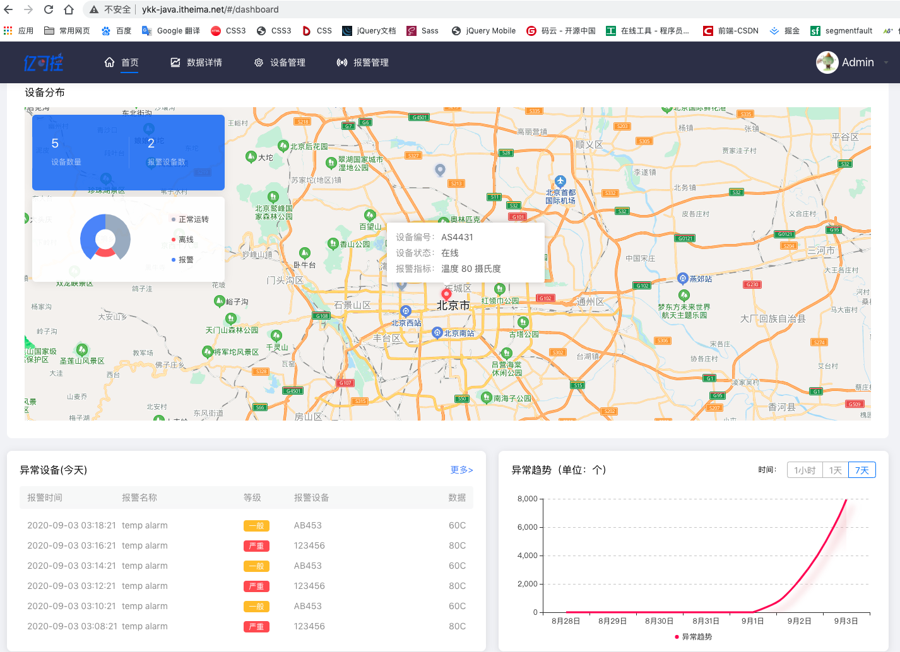
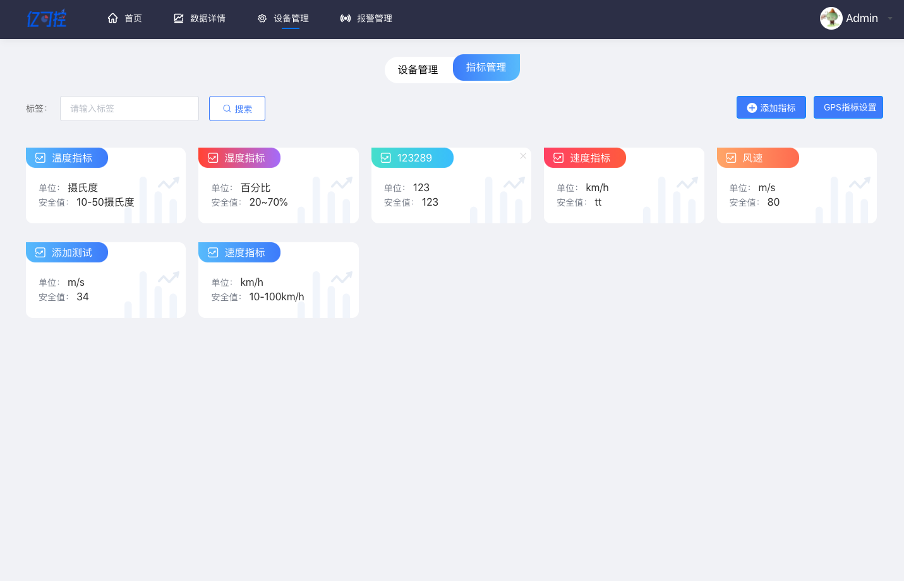

## 亿可控

- 线上：http://172.17.0.231/index.html
- 线上：http://ykk-java.itheima.net
- git：http://git.itcast.cn/development/project-yikekong-cmm-ts-vue/tree/v2.0

## 预览



### 安装依赖

```bash
yarn install
```

### 启动本地开发环境（自带热启动）

```bash
yarn serve
```

### 构建生产环境 (自带压缩)

```bash
yarn build
```

### 代码格式检查以及自动修复

```bash
yarn lint
```

### 运行单元测试

```bash
yarn test:unit
```

### 运行端对端测试

```bash
yarn test:e2e
```

### 自动生成 svg 组件

```bash
yarn svg
```

### 自定义 Vue 配置

看这里 [Configuration Reference](https://cli.vuejs.org/config/).

## 浏览器支持
